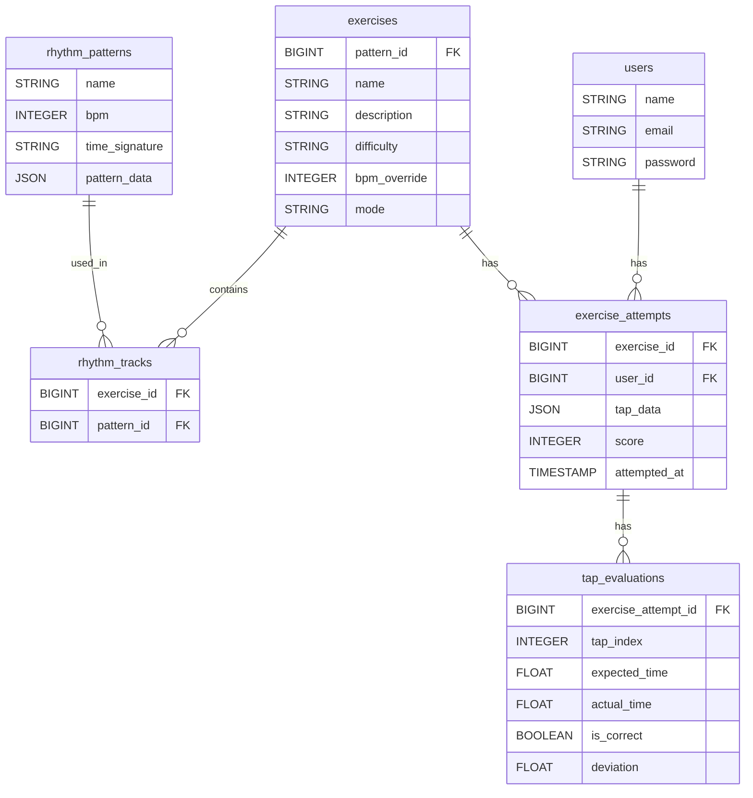

```mermaid
erDiagram

    rhythm_patterns {
        STRING name
        INTEGER bpm
        STRING time_signature
        JSON pattern_data
    }

    exercises {
        BIGINT pattern_id FK
        STRING name
        STRING description
        STRING difficulty
        INTEGER bpm_override
        STRING mode
    }

	rhythm_tracks {
        BIGINT exercise_id FK
        BIGINT pattern_id FK
    }

    users {
        STRING name
        STRING email
        STRING password
    }

    exercise_attempts {
        BIGINT exercise_id FK
        BIGINT user_id FK
        JSON tap_data
        INTEGER score
        TIMESTAMP attempted_at
    }

    tap_evaluations {
        BIGINT exercise_attempt_id FK
        INTEGER tap_index
        FLOAT expected_time
        FLOAT actual_time
        BOOLEAN is_correct
        FLOAT deviation
    }

	rhythm_patterns ||--o{ rhythm_tracks : used_in
    exercises ||--o{ rhythm_tracks : contains
    exercises ||--o{ exercise_attempts : has
    users ||--o{ exercise_attempts : has
    exercise_attempts ||--o{ tap_evaluations : has
```
