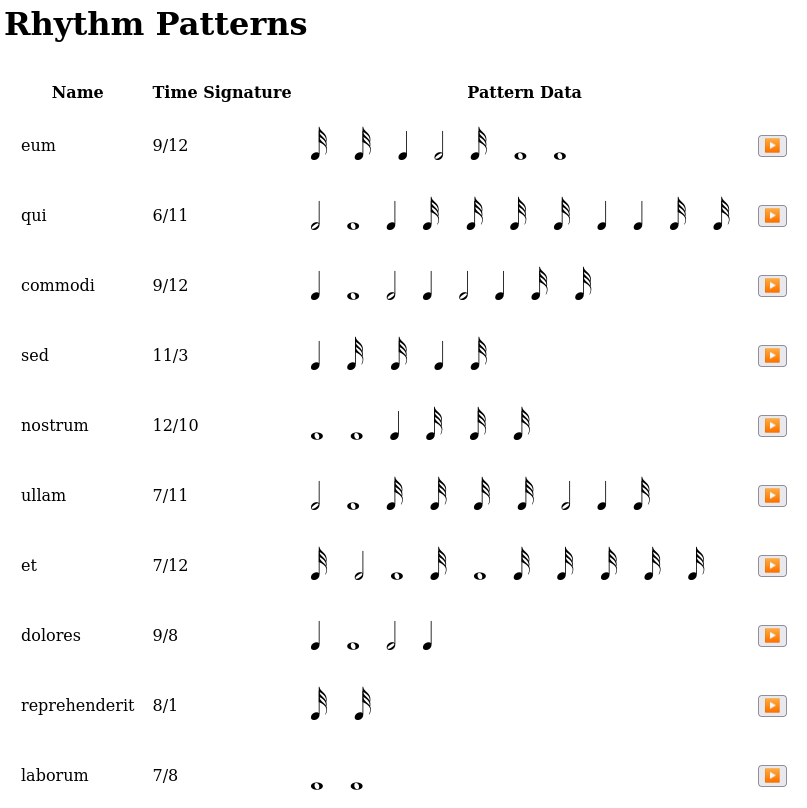

### 🎵 Rhythm Imitation App (Laravel + JS)

A desktop-focused web app for **practicing and evaluating rhythm imitation**, inspired by apps like [Complete Rhythm Trainer](https://play.google.com/store/apps/details?id=com.binaryguilt.completerhythmtrainer) and [Rhythmer](https://play.google.com/store/apps/details?id=ru.demax.rhythmerr).

Built with:

* **Laravel (API backend)** for exercise structure, rhythm pattern storage, and progress tracking.
* **JavaScript frontend** for interactive rhythm playback and tap-based input.
* Designed to be **auth-optional** — anonymous play supported, with optional login for saving progress.



---

### 🔧 Features (MVP)

* 🎼 Rhythm pattern database (BPM, time signature, note durations)
* 🖱️ User input via tap key or button
* 🧠 Evaluation engine comparing taps to expected rhythm
* 📊 Progress tracking with scoring
* 📁 API-first architecture (RESTful endpoints)

---

### 🚧 Roadmap

* [ ] Add user authentication (optional)
* [ ] Rhythm pattern composer/editor
* [ ] Performance charts & streaks
* [ ] Audio latency calibration
* [ ] Gamification (XP, levels, medals)


## About Laravel API Boilerplate
This is a boilerplate for writing RESTful API projects using Laravel. The aim of this boilerplate is to provide developers with scaffolding and common functionality which will make writing APIs exceedingly quick, efficient and convenient.

It is intended for this repository to be used when starting a new API project. Therefore, instead of cloning the laravel repository, you should clone this one.

The principles of this boilerplate are to;

 - Save developers considerable effort by using reasonable conventions
 - Allow for everything the boilerplate provides to be easily extended and entirely customised to suit developer needs, through normal PHP inheritance
   - As well as allow developers to easily use the boilerplate functionality and mix it in with their own implementation
 - Follow REST standards very closely
 - Use existing Laravel features and existing Laravel add-on packages where possible
 - Add many convenient features useful for writing APIs
 - Maintain a high level of performance

# Development

To compile SASS and move JS, webpack mix is used; it can be run using (see `package.json`):
```
npm run watch
```

## Check out the documentation of supporting projects

Every great project stands on the shoulders of giants. Check out the documentation of these key supporting packages to learn more;

 - [Laravel](https://laravel.com/docs/)
 - [Dingo API](https://github.com/dingo/api/wiki)
 - [Tymon JWT Auth](https://github.com/tymondesigns/jwt-auth)
 - [League Fractal](https://fractal.thephpleague.com/)
 - [Laravel UUID](https://github.com/webpatser/laravel-uuid/tree/2.1.1)

## Recommended Packages

I have tried to include only the packages thought absolutely necessary, so here is a list of packages I recommend checking out:

#### General 
 - [PHP CodeSniffer](https://github.com/squizlabs/PHP_CodeSniffer)
 - [PHP-VCR](https://github.com/php-vcr/php-vcr)

#### For Debugging 
 - [Bugsnag for Laravel](https://github.com/bugsnag/bugsnag-laravel)
 - [Sentry](https://github.com/getsentry/sentry-laravel)

